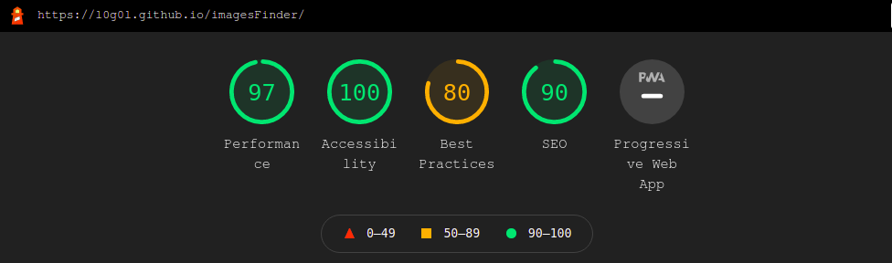
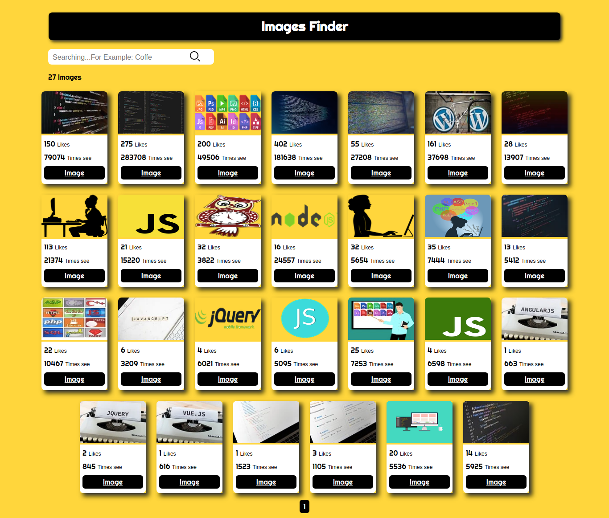
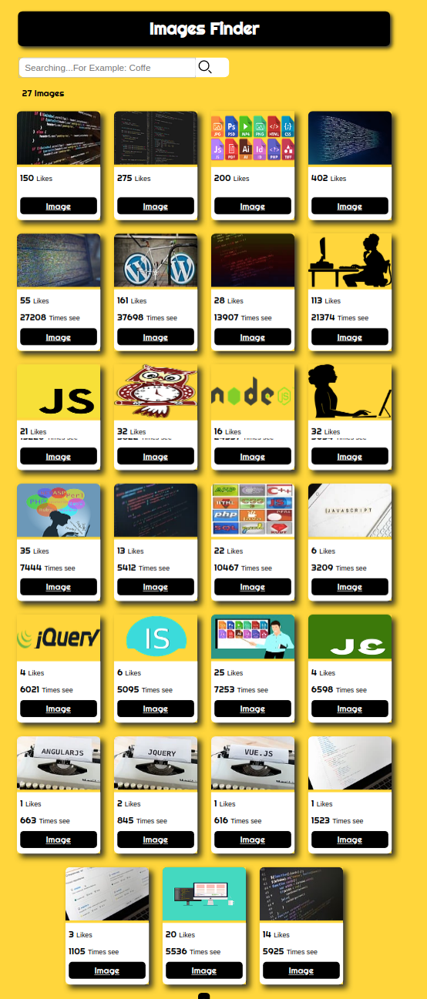

<!-- PROJECT LOGO -->
<br />
<p align="center">
<h4 align="center">Images Finder</h4>
  <p align="center">
    <a href="https://l0g0l.github.io/imagesFinder/">View Web Application</a>
  </p>
  <p align="center">

</p>
<p align="center">
</p>

<p align="center">
</p
</p>

<!-- TABLE OF CONTENTS -->
<details open="open">
  <summary>Table of Contents</summary>
  <ol>
    <li><a href="#prerequisites">Prerequisites</a></li>
    <li><a href="#installation">Installation</a></li>
    <li><a href="#about-the-project">About The Project</a></li>
    <li><a href="#app-overview">App Overview</a></li>
    <li><a href="#languages-and-tools">Languages and Tools</a></li>
    <li><a href="#contact">Contact</a></li>
  </ol>
</details>


### Prerequisites


- Clone the repository on your local machine (https://github.com/l0g0l/buscadorRepos_FrontEnd.git)

## Installation


```sh
cd imagesFinder go into the folder
```


```sh
To open the HTMl file in the browser you have several options:

1- You look for the HTML file you want to view, right click on it and choose Open with from the menu. You will see a complete list of applications that you can use to run the file. The default browser will be at the top of the list.
You select Google Chrome from the list and see your file in the browser.

2-Drag and drop the HTML file directly into a new tab. Chrome will automatically open the page

```


<!-- ABOUT THE PROJECT -->

## About The Project

Creation of a Images finder


### Requirements  

-Develop a web aplication with HTML, CSS and JavaScript.  
-Request API Pixabay.
-Responsive to Desktop, Tablet and Mobile.
-Deploy
-Version control management with GiT.


<!-- APP OVERVIEW -->

## App Overview  

##### Desktop



<br>
<br>  

##### Tablet




<br>
<br>

##### Moblie


<br>

<!-- ACKNOWLEDGEMENTS -->

## Languages and Tools:


The project is deployed in [GitHub Pages](https://pages.github.com/)  
<br>

<p align="left">
 <a href="https://www.w3.org/html/" target="_blank">  </a> 
    <a href="https://www.w3schools.com/css/" target="_blank"> 
        
    </a> 
    <a href="https://developer.mozilla.org/en-US/docs/Web/JavaScript" target="_blank">
        
    </a>
    <a href="https://git-scm.com/" target="_blank">
        
    </a>
       <a href="https://pages.github.com/" target="_blank">
        
    </a>
    
</p>

<!-- CONTACT -->

## Contact

Lucía González

[](https://github.com/l0g0l)

[](https://www.linkedin.com/in/luciagonzalezlara)
